<div align="center">

# 🗄️ SQL SERVER MODULE

### *A guided walkthrough of Microsoft SQL Server — administration, tables, snapshots, replication & performance.*

<p align="center">
  
</p>


</div>

---

## 📖 About This Repository

A hands-on learning repository built alongside **four official SQL Server course manuals**.
Everything here is reconstructed from scratch — database schemas, scripts, and notes — so
that the repository itself tells the story of the course.

> **Design principle:** *databases are not stored in Git — only the scripts that build them are.*
> Every schema change in this project exists as a numbered `.sql` file, so any database
> can be rebuilt from an empty SQL Server instance at any point in time.

---

## 🖥️ Live Environment

| Property | Value |
|---|---|
| **Instance name** | `MSSQLSERVER` *(default instance)* |
| **Server name** | `LEOKINGXLING` |
| **Engine** | SQL Server 2025 (17.0.1000.7) |
| **Edition** | Enterprise Developer Edition (64-bit) |
| **Authentication** | Windows Authentication (no SQL password stored anywhere) |
| **Collation** | `SQL_Latin1_General_CP1_CI_AS` — *CI* = Case-Insensitive, *AS* = Accent-Sensitive |
| **Course database** | `StudentRecordsDB` |
| **OS** | Windows 10 Home (ARM64) |

### System Databases

| Database | Purpose |
|---|---|
| `master` | Servers, logins, database metadata. **SQL Server cannot start without it.** |
| `model` | **Template** — every new database is cloned from this one. |
| `msdb` | Scheduled jobs, backup history (SQL Agent). |
| `tempdb` | Scratch space for temp tables and sorts. **Rebuilt from scratch on every restart.** |

> ⚠️ **Never create user objects in a system database.** `master` must be available at all
> times, and custom tables there can break upgrades and service packs.

---

## 📚 Course Roadmap

Built strictly from the four lecturer manuals, in dependency order.

### Part 1 — Installation & Configuration `◐`
- [x] Create a database
- [x] Inspect `.mdf` data files and `.ldf` transaction logs
- [x] Understand the `model` template
- [x] Read `collation_name` and decode `CI` / `AS`
- [x] Read `compatibility_level` and understand 2005 vs 2025 differences
- [ ] Editions — Enterprise, Standard, Express, Developer
- [ ] Default instance vs named instances
- [ ] Multiple instances on one machine
- [ ] Service accounts
- [ ] Windows vs Mixed authentication
- [ ] Collation in depth & per-column collation

**Scripts:** [`sql/01_databases/`](sql/01_databases) ·
**Notes:** [Manual 1](notes/01_manual_1_installation.md)

### Part 2 — Tables & Database Objects `◔`
- [ ] Data types & the 7 categories
- [ ] `CREATE TABLE` — the six course tables
- [ ] Permanent tables  ⬅️ **next**
- [ ] Temporary tables (`#`)
- [ ] Table variables (`@`)
- [ ] `IDENTITY` and seeding
- [ ] `NULL` vs `NOT NULL`
- [ ] Primary keys, foreign keys, `UNIQUE`
- [ ] Computed columns (`AS (...)`)
- [ ] Permissions and `GRANT`

**Scripts:** [`sql/02_tables/`](sql/02_tables) ·
[`sql/03_security/`](sql/03_security) ·
**Notes:** [Manual 2](notes/02_manual_2_tables.md)

### Part 3 — Snapshots & Replication `⬜`
- [ ] Database snapshots
- [ ] Copy-on-write behaviour
- [ ] Creating and reverting snapshots
- [ ] Snapshot / transactional / merge replication
- [ ] Replication agents

**Scripts:** [`sql/04_snapshots/`](sql/04_snapshots) ·
[`sql/05_replication/`](sql/05_replication) ·
**Notes:** [Manual 3](notes/03_manual_3_snapshots_replication.md)

### Part 4 — Monitoring & Troubleshooting `⬜`
- [ ] SQL Server Profiler
- [ ] SQL Trace
- [ ] Workload analysis
- [ ] Locking and blocking
- [ ] Deadlocks
- [ ] Isolation levels
- [ ] Database Engine Tuning Advisor

**Scripts:** [`sql/06_monitoring/`](sql/06_monitoring) ·
**Notes:** [Manual 4](notes/04_manual_4_monitoring.md)

---

## 🧱 The Course Schema

Six permanent tables, following the lecturer's specification.

<p align="center">
  
</p>

### 🧠 Why the junction table exists

One customer can have **many** addresses. One address can belong to **many** customers.
That is a **many-to-many** relationship, and T-SQL cannot express it with a single foreign key.

The solution is a **third table** whose rows *are* the links. Every many-to-many
relationship in every database you will ever meet follows this pattern.

### Key column reference

| Column | Type | Constraints | Notes |
|---|---|---|---|
| `Customer.CustomerID` | `int IDENTITY(1,1)` | `PRIMARY KEY` | Auto-generated, never reused |
| `Customer.CustomerName` | `varchar(50)` | `NOT NULL UNIQUE NONCLUSTERED` | |
| `Customer.CreditLine` | `smallmoney` | `NULL` | *smallmoney* = 4 decimals |
| `Customer.AvailableCredit` | — | `AS (CreditLine - OutstandingBalance)` | **Computed** — not stored, recalculated on read |
| `AddressType.AddressTypeID` | `tinyint IDENTITY(1,1)` | `PRIMARY KEY` | *tinyint* = 0–255 only, deliberate space saving |

---

## 📁 Repository Structure

```text
SQL-SERVER-MODULE/
├── .gitignore              # secrets, *.bak/*.mdf/*.ldf, VS junk, manuals/
├── README.md               # this file
├── assets/
│   ├── banner.svg         # animated terminal header
│   ├── schema.svg         # animated ER diagram
│   ├── codeeditor.svg     # animated CREATE TABLE typing
│   └── gitlog.svg         # animated git log + recovery
├── notes/                  # teaching notes, one per lecturer manual
│   ├── 01_manual_1_installation.md
│   ├── 02_manual_2_tables.md
│   ├── 03_manual_3_snapshots_replication.md
│   ├── 04_manual_4_monitoring.md
│   └── 05_exercises_and_answers.md
└── sql/
    ├── 01_databases/       # Part 1  — CREATE DATABASE, filegroups, instances
    ├── 02_tables/          # Part 2  — CREATE TABLE, types, IDENTITY, temp tables
    ├── 03_security/        # Part 2  — GRANT, REVOKE, DENY, roles
    ├── 04_snapshots/       # Part 3  — create / read / drop database snapshots
    ├── 05_replication/     # Part 3  — types, agents, inspection queries
    └── 06_monitoring/      # Part 4  — locks, blocking, deadlocks, isolation
```

## 🎬 Animated Diagrams

All four graphics in this README are hand-written SVG with embedded CSS and SMIL
animation. **No JavaScript, no GIFs, no external services, nothing that phones
home.**

| Asset | What it shows |
|---|---|
| [`assets/banner.svg`](assets/banner.svg) | Terminal typing your live instance details, blinking cursor, floating database cylinder |
| [`assets/schema.svg`](assets/schema.svg) | The six-table ER diagram — boxes pop in, FK lines draw themselves, packets travel along them |
| [`assets/codeeditor.svg`](assets/codeeditor.svg) | An editor typing the lecturer's actual `CREATE TABLE dbo.Country`, with a moving caret and a success toast |
| [`assets/gitlog.svg`](assets/gitlog.svg) | `git log --graph` scrolling, then recovering your deleted `SALES.sql` from history |

<p align="center">
  
</p>

### Why inline SVG and not CSS in the markdown?

GitHub **strips `<script>` and `<style>` tags from markdown**, so CSS tricks in a
README do nothing. But GitHub serves `.svg` files as genuine images, and **CSS
and SMIL animations inside an SVG do play** when it is embedded with ``.
So the styling and the animation both live inside the SVG file instead of in
the markdown.

### Accessibility

Every asset honours `prefers-reduced-motion`. If you have **"reduce motion"**
enabled in Windows or macOS, they render as clean static images instead of
animating.

### Where it works

Animations play on the **repo's main page in a browser**. They do **not** animate
in the GitHub mobile app, in the file preview, or in the API/raw view.

To edit any of them: open the `.svg` in a text editor or browser and change the
`<text>` elements. Everything is plain XML — there is no build step.

---

### Two conventions

**Numbering.** Scripts are numbered so they run in order, and each file is
self-contained with `USE` / `GO` where needed.

**Read before running.** Every script is heavily commented with the *why*, not
just the *what*. Scripts that can destroy data are marked `DESTRUCTIVE` at the
top and again at the offending statement.

### Validating before you run

Every script has been syntax-checked with `SET PARSEONLY ON`, which parses T-SQL
without executing a single statement:

```sql
SET PARSEONLY ON;
GO
-- then your script
```

The two files reporting *"database does not exist"* are the ones whose
verification queries reference a database the script has not created yet — they
are expected and correct.

---

## 🔀 Git Workflow

<p align="center">
  
</p>

```bash
git status              # what changed?          <- run this most often
git add .               # stage changes
git commit -m "msg"     # save a snapshot
git log --oneline       # view history
git push                # upload to GitHub
```

### Recovering deleted files

Git never truly deletes anything while history exists.

```bash
git show <commit>:<path>              # print an old version
git checkout <commit> -- <path>       # restore it to disk
```

Your original `SALES.sql` — the filegroup exercise with the broken `D:\` paths —
was deleted three commits ago and is still fully recoverable. See the animation
above.

### Useful extras

| Command | Purpose |
|---|---|
| `git diff` | Show line-by-line changes |
| `git log --graph --oneline` | Visualise branch history |
| `git branch -vv` | Show branches + tracking |
| `git remote -v` | List remotes |
| `git switch -c <name>` | Create and switch to a branch |
| `git stash` | Temporarily shelve uncommitted work |
| `git check-ignore -v <file>` | Show *which* `.gitignore` rule matched |

---

## 🧪 Exercises

**[`notes/05_exercises_and_answers.md`](notes/05_exercises_and_answers.md)** —
20 exercises across five difficulty levels, from `DB_NAME()` basics to deadlocks
and lost updates. Answers are in collapsible sections so you cannot see them
by accident.

```
🟢 Level 1  Warm-up           — context, system databases, compatibility level
🟡 Level 2  Data types       — DECIMAL(p,s), NULL, temp table scope
🟠 Level 3  Constraints      — joins, foreign keys, the junction table
🔴 Level 4  Troubleshooting  — the diagnostic ladder, deadlocks, isolation
🔵 Level 5  Snapshots        — copy-on-write, agents, transactional vs merge
```

---

## 📚 Course Notes

| Manual | Topic | Notes |
|---|---|---|
| 1 | Installation, editions, instances, authentication, collation | [Open](notes/01_manual_1_installation.md) |
| 2 | Tables, data types, temp tables, permissions, `GRANT` | [Open](notes/02_manual_2_tables.md) |
| 3 | Database snapshots and replication | [Open](notes/03_manual_3_snapshots_replication.md) |
| 4 | Profiler, locking, deadlocks, isolation levels | [Open](notes/04_manual_4_monitoring.md) |

Each note file is written **from the lecturer manual's own outline**, with the
manuals' terminology, plus the 2005 → 2025 differences called out where they
matter.

---

## 🔒 Security Rules

Non-negotiable in this project:

1. ❌ Never commit a password, token, or connection string
2. ❌ Never write a password into a URL — it lands in `.git/config` in plain text
3. ❌ Never type credentials into this chat
4. ✅ Use Windows Authentication (no SQL password exists at all)
5. ✅ `.gitignore` already excludes `.env`, `*.pfx`, `*.key`, `secrets.json`
6. ✅ Sanitise before publishing — `SELECT LEFT(password,2) + '***'` instead of `SELECT *`

> Once a secret is committed it lives in history **forever**. Deleting the file later
> does not remove it. Prevention is the only real defence.

---

## 🧠 Concept Glossary

| Term | Meaning |
|---|---|
| **Instance** | A separate, self-contained SQL Server installation |
| **Default instance** | `MSSQLSERVER`, reached without naming it |
| **Named instance** | Reached as `SERVER\NAME` |
| **Schema** | A namespace grouping objects — `dbo` is the default |
| **`.mdf`** | Master data file — holds tables and indexes |
| **`.ldf`** | Log data file — records every change for recovery |
| **`IDENTITY`** | Auto-generates and enforces uniqueness |
| **`NULL`** | Value is unknown or not applicable — *not* zero or `''` |
| **Computed column** | Derived on read via `AS (...)`, never stored |
| **Junction table** | Resolves a many-to-many relationship |
| **Collation** | Rules for sorting and comparing text |
| **Compatibility level** | Pins old query optimizer behaviour |
| **Copy-on-write** | Snapshot pages are copied only when the source changes |

---

## 🛡️ Environment Safety Rules

- ✅ **SQL Server is started manually by the user.** Never start, stop, or restart services.
- ✅ Never install, reinstall, upgrade, or uninstall SQL Server.
- ✅ Never create additional instances.
- ✅ Never change server configuration, ports, or authentication modes.
- ✅ **SQL Server being off is not a problem** — the user simply has not started it yet.
- ⚠️ `DROP DATABASE`, `DROP TABLE`, `DELETE` without `WHERE`, and `TRUNCATE TABLE`
  are explained and confirmed before use. **Every time.**

---

## 📄 Source Material

Four lecturer manuals, converted from PDF to searchable text (kept local, never
committed — they are Microsoft-copyrighted documentation):

| Part | Topic | Status |
|---|---|---|
| 1 | Installation, editions, instances, authentication, collation | ✅ converted |
| 2 | Tables, data types, temporary tables, permissions, `GRANT` | ✅ converted |
| 3 | Database snapshots and replication | ✅ converted |
| 4 | Profiler, SQL Trace, locking, deadlocks, isolation levels | ✅ converted |

> **Note on versioning:** the manuals target **SQL Server 2005** (compatibility level 90).
> This project runs on **SQL Server 2025** (level 170). Core concepts are unchanged, but
> some syntax differs — `DATE`, `TIME`, and `DATETIME2` did not exist in 2005. Where a
> difference matters, it is called out in the relevant script.

---

<div align="center">

**Built one commit at a time.**

`git log --oneline` is the changelog. Every mistake is a commit you can read.

</div>
